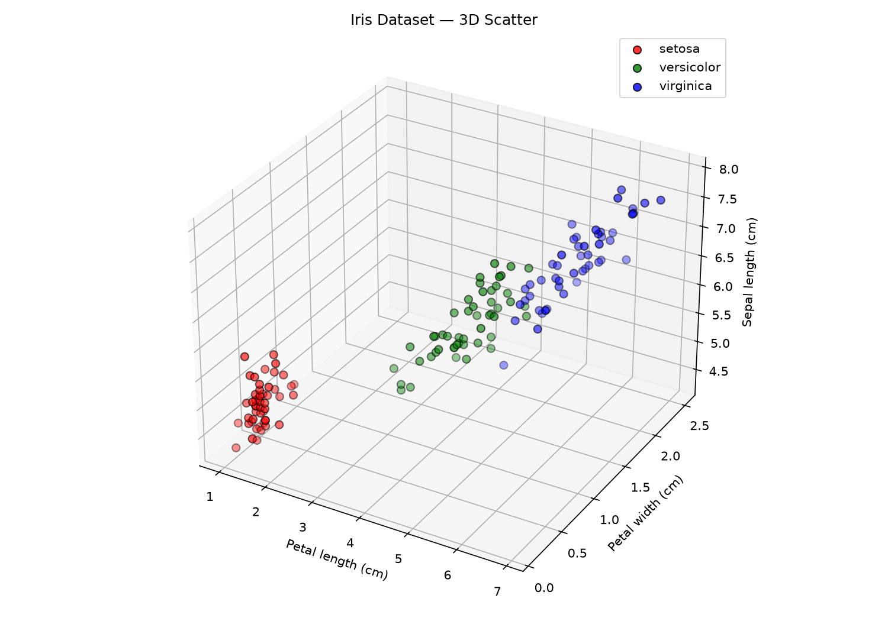
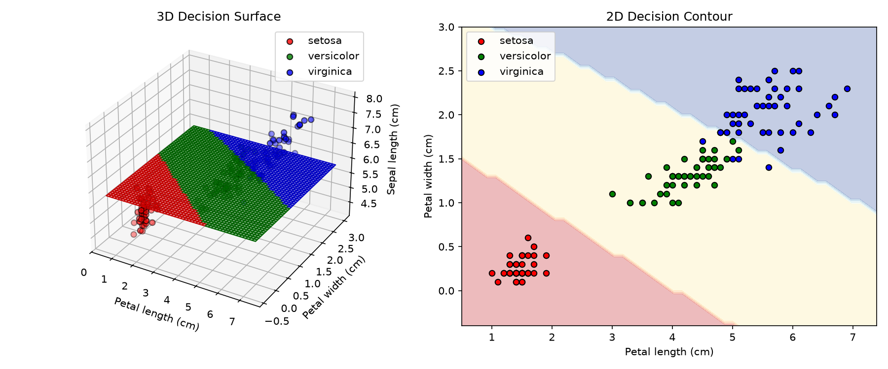
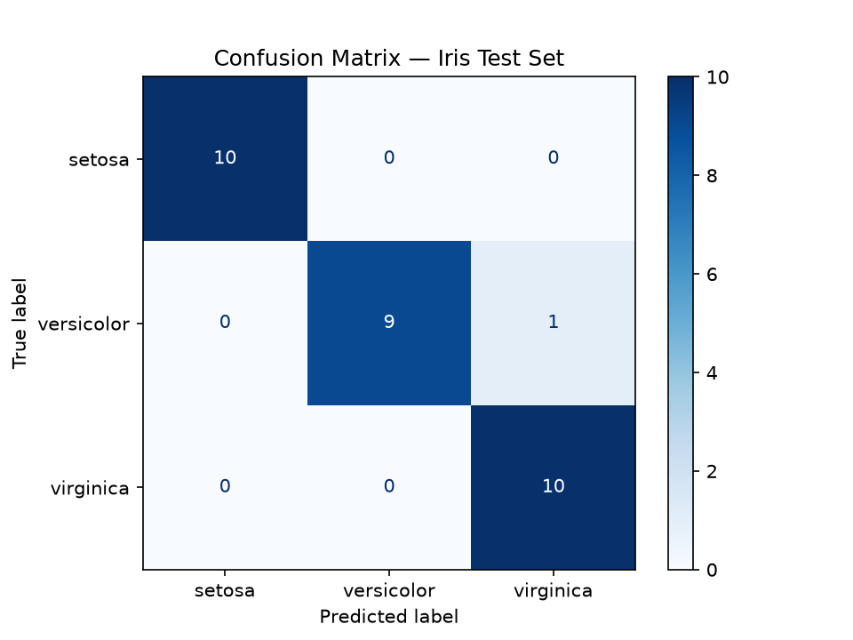

# 🌸 Iris Species Classifier — CRISP-DM + Streamlit

Interactive Iris classification app built with **scikit-learn** following the **CRISP-DM** methodology, deployed on **Streamlit Cloud**.

🔗 **Live Demo:** [l-11-lris-classification.streamlit.app](https://l-11-lris-classification.streamlit.app/)

## 🧠 CRISP-DM Pipeline

| Phase | Description |
|---|---|
| **1. Business Understanding** | Goal: classify 3 Iris species (setosa, versicolor, virginica) with ≥95% accuracy |
| **2. Data Understanding** | 150 samples, 4 features, balanced classes — 3D scatter visualization |
| **3. Data Preparation** | 80/20 stratified split, StandardScaler normalization |
| **4. Modelling** | 4 candidates (KNN, SVM, Logistic Regression, Random Forest) → SVM tuned via GridSearchCV (C=1, gamma=0.1) → **98.33% CV accuracy** |
| **5. Evaluation** | **96.67% test accuracy** — confusion matrix, classification report, 3D decision surface |
| **6. Deployment** | Live species prediction from user inputs |

## 🚀 Run Locally

```bash
pip install -r requirements.txt
streamlit run streamlit_app.py
```

## 📦 Requirements

- Python 3.9+
- streamlit
- scikit-learn
- matplotlib
- numpy

## ☁️ Deploy to Streamlit Cloud

1. Push this repo to GitHub
2. Go to [streamlit.io/cloud](https://streamlit.io/cloud)
3. Sign in with GitHub → **New app**
4. Select this repo → Branch `master` → Main file `streamlit_app.py`
5. Click **Deploy**

## 📁 Files

| File | Purpose |
|---|---|
| `streamlit_app.py` | Streamlit interactive app |
| `iris_crispdm.py` | Standalone CRISP-DM pipeline script |
| `requirements.txt` | Python dependencies |

## 🖼️ 3D Visualizations

- **3D Scatter**: petal length × petal width × sepal length, colored by species
- **3D Decision Surface**: SVM decision regions projected onto the 3D feature space
- **2D Decision Contour**: traditional decision boundary in petal length × petal width plane




